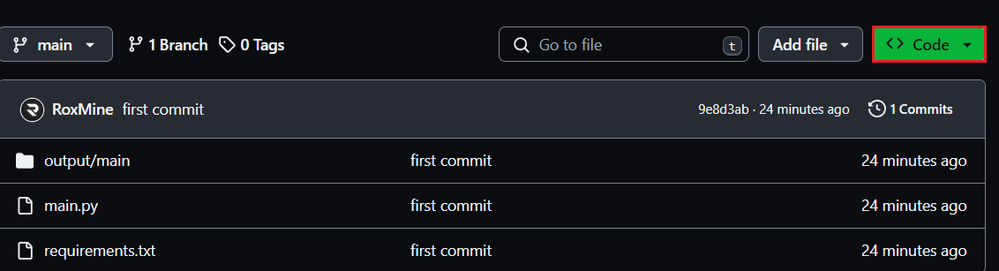
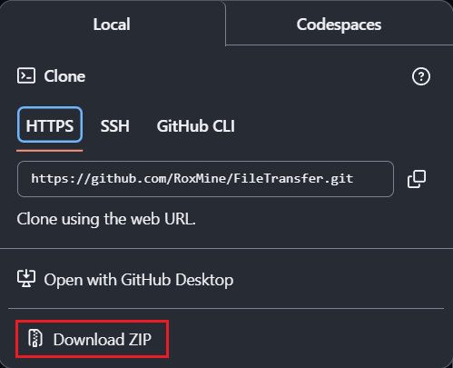
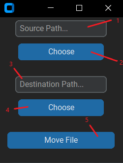

# FileTransfer
**FileTransfer** is a program that allows you to move a file to another directory. The good thing about it is that if this file already exists, it will simply be replaced directly. This is helpful, for example, in Minecraft Spigot plugin programming. You usually have to restart the localhost server if you want to replace the plugin file. The reason for this is that in Windows you cannot simply replace a file when it is in use. This little program is very useful to get around that.

# Installation
## 1. Download

## 2. How to use

- **1:** The source file path

- **2:** Choose the file directly

- **3:** The destination file path

- **4:** Choose the file directly

- **5:** Move/Transfer the file